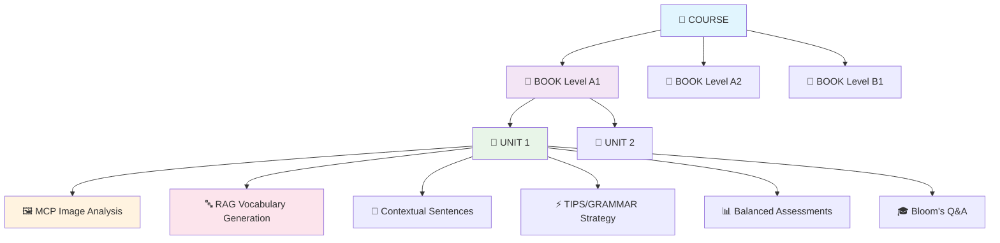

## 📊 Métricas de Qualidade Científica

### ✅ Validação Automática (22 Pontos de Controle)

O IVO V2 implementa **22 validações automáticas** em cada unidade gerada:

```python
QUALITY_CHECKLIST = {
    # Estrutura Pedagógica (8 pontos)
    "hierarchical_consistency": "Course→Book→Unit válida",
    "cefr_level_appropriate": "Vocabulário adequado ao nível",
    "learning_objectives_clear": "Objetivos mensuráveis",
    "content_coherence": "Coerência entre seções",
    "vocabulary_progression": "Progressão natural 15-35 palavras",
    "strategy_application": "TIPS/GRAMMAR aplicada corretamente",
    "assessment_balance": "2 atividades complementares",
    "qa_bloom_coverage": "Taxonomia de Bloom completa",
    
    # Qualidade Linguística (7 pontos)
    "ipa_phoneme_validity": "100% fonemas IPA válidos",
    "vocabulary_relevance": "85%+ relevância contextual",
    "sentence_connectivity": "Sentences conectadas ao vocabulário",
    "l1_interference_prevention": "Erros PT→EN prevenidos",
    "language_variant_consistency": "American/British consistente",
    "pronunciation_integration": "Consciência fonética desenvolvida",
    "cultural_appropriateness": "Contexto culturalmente adequado",
    
    # RAG e Progressão (7 pontos)
    "vocabulary_deduplication": "90%+ palavras novas",
    "reinforcement_balance": "# 🚀 IVO V2 - Intelligent Vocabulary Organizer

> **Sistema avançado de geração hierárquica de unidades pedagógicas** com IA generativa, RAG contextual e metodologias comprovadas para ensino de idiomas. Arquitetura Course → Book → Unit com prevenção de interferência L1→L2.


## 🎯 Visão Geral

O **IVO V2** é um sistema de inteligência artificial especializado em **geração hierárquica automatizada** de materiais didáticos para ensino de idiomas. Desenvolvido com metodologia científica baseada no **Método Direto**, **Estratégias TIPS/GRAMMAR** e **Taxonomia de Bloom**, o sistema oferece:

### 🌟 Arquitetura Hierárquica Inovadora

```
📚 COURSE (Curso Completo)
├── 📖 BOOK (Módulo por Nível CEFR)
│   ├── 📑 UNIT (Unidade Pedagógica)
│   │   ├── 🔤 VOCABULARY (com IPA e fonemas)
│   │   ├── 📝 SENTENCES (conectadas ao vocabulário)
│   │   ├── ⚡ STRATEGIES (TIPS 1-6 ou GRAMMAR 1-2)
│   │   ├── 📊 ASSESSMENTS (2 de 7 tipos disponíveis)
│   │   └── 🎓 Q&A (Taxonomia de Bloom)
│   └── 📑 UNIT N...
└── 📖 BOOK N...
```

### 🧠 Principais Diferenciais Técnicos

- **🎯 RAG Hierárquico**: Prevenção inteligente de repetições usando contexto Course→Book→Unit
- **🗣️ Validação IPA**: Transcrições fonéticas com 35+ símbolos IPA validados
- **📊 Assessment Balancing**: Seleção automática de 2/7 atividades com análise de variedade
- **🖼️ MCP Image Analysis**: Análise de imagens via Model Context Protocol
- **🇧🇷 Interferência L1→L2**: Prevenção automática de erros português→inglês
- **📈 Paginação Inteligente**: Sistema completo com filtros, ordenação e cache
- **🔒 Rate Limiting**: Proteção multinível com Redis ou cache em memória
- **📝 Audit Logging**: Sistema completo de auditoria e métricas

## 🏗️ Arquitetura do Sistema



### 🔄 Fluxo de Geração Avançado

```
📤 Form Upload (Imagens + Contexto)
    ↓
🖼️  MCP Image Analysis (OpenAI Vision)
    ↓
🧠 RAG Context Building (Hierarquia + Precedentes)
    ↓
🔤 IPA Vocabulary Generation (25 palavras validadas)
    ↓
📝 Connected Sentences (12-15 usando vocabulário)
    ↓
⚡ Smart Strategy Selection (TIPS 1-6 ou GRAMMAR 1-2)
    ↓
📊 Assessment Balancing (2 de 7 tipos otimizados)
    ↓
🎓 Bloom's Taxonomy Q&A (8-12 perguntas pedagógicas)
    ↓
📄 PDF Export + Database Storage
```

## ⚡ Quick Start Avançado

### Pré-requisitos

- Python 3.11+
- UV Package Manager (ultra-rápido!)
- Supabase Database
- OpenAI API Key
- Redis (opcional, fallback para memória)

### Instalação Completa

```bash
# 1. Instalar UV (gerenciador moderno)
curl -LsSf https://astral.sh/uv/install.sh | sh

# 2. Clonar e configurar
git clone https://github.com/seu-usuario/ivo-v2.git
cd ivo-v2

# 3. Instalar dependências
uv sync

# 4. Configurar ambiente completo
cp .env.example .env
# Editar .env com suas chaves:
# OPENAI_API_KEY=sk-...
# SUPABASE_URL=https://...
# SUPABASE_ANON_KEY=...
# REDIS_URL=redis://localhost:6379 (opcional)

# 5. Executar migrações do banco
# (SQL schema será fornecido na documentação)

# 6. Iniciar servidor com todas as funcionalidades
uv run uvicorn src.main:app --reload --log-level debug
```

### 🚀 Inicialização Rápida

```bash
# Servidor principal
uvicorn src.main:app --reload

# MCP Image Analysis Server (terminal separado)
python src/mcp/image_analysis_server.py

# Interface web disponível em:
# http://localhost:8000
# Documentação API: http://localhost:8000/docs
```

## 📊 API Hierárquica v2 - Endpoints Principais

### 🎯 Core Hierarchy Operations

```bash
# === COURSES ===
POST   /api/v2/courses                    # Criar curso
GET    /api/v2/courses?page=1&size=20    # Listar com paginação
GET    /api/v2/courses/{id}              # Detalhes do curso
GET    /api/v2/courses/{id}/hierarchy    # Hierarquia completa
PUT    /api/v2/courses/{id}              # Atualizar curso

# === BOOKS ===
POST   /api/v2/courses/{id}/books        # Criar book no curso
GET    /api/v2/courses/{id}/books        # Listar books paginado
GET    /api/v2/books/{id}                # Detalhes do book
GET    /api/v2/books/{id}/progression    # Análise pedagógica

# === UNITS ===
POST   /api/v2/books/{id}/units          # Criar unit (Form Data)
GET    /api/v2/books/{id}/units          # Listar units paginado
GET    /api/v2/units/{id}                # Unit completa
GET    /api/v2/units/{id}/context        # Contexto RAG
```

### 🧠 Content Generation Pipeline

```bash
# === GERAÇÃO SEQUENCIAL ===
POST   /api/v2/units/{id}/vocabulary     # 1. Gerar vocabulário (IPA)
POST   /api/v2/units/{id}/sentences      # 2. Sentences conectadas
POST   /api/v2/units/{id}/tips           # 3a. TIPS (lexical)
POST   /api/v2/units/{id}/grammar        # 3b. GRAMMAR (grammatical)
POST   /api/v2/units/{id}/assessments    # 4. Atividades balanceadas
POST   /api/v2/units/{id}/qa             # 5. Q&A pedagógico

# === ANÁLISE E QUALIDADE ===
GET    /api/v2/units/{id}/vocabulary/analysis
GET    /api/v2/units/{id}/sentences/analysis
GET    /api/v2/units/{id}/qa/analysis
```

### 📝 Estrutura de Request (Unit Creation)

```bash
curl -X POST "/api/v2/books/{book_id}/units" \
  -H "Content-Type: multipart/form-data" \
  -F "image_1=@hotel_reception.jpg" \
  -F "image_2=@booking_desk.jpg" \
  -F "context=Hotel reservation and check-in procedures" \
  -F "cefr_level=A2" \
  -F "language_variant=american_english" \
  -F "unit_type=lexical_unit"
```

### 🔍 Filtros e Paginação Avançada

```bash
# Busca com filtros múltiplos
GET /api/v2/courses?search=business&language_variant=american_english&page=2

# Ordenação personalizada
GET /api/v2/units?sort_by=quality_score&sort_order=desc&status=completed

# Filtros por qualidade
GET /api/v2/units?quality_score_min=0.8&unit_type=lexical_unit
```

## 🎓 Metodologia Pedagógica Científica

### 📖 Sistema TIPS (Estratégias Lexicais)

O IVO V2 implementa **6 estratégias TIPS** baseadas em neurociência do aprendizado:

| Estratégia | Algoritmo de Seleção | Exemplo Prático | Benefício Cognitivo |
|------------|---------------------|-----------------|-------------------|
| **TIP 1: Afixação** | `if has_prefixes_suffixes()` | unsafe, teacher, quickly | Expansão sistemática +300% |
| **TIP 2: Compostos** | `if same_semantic_field()` | telephone → cellphone, phone booth | Agrupamento temático |
| **TIP 3: Colocações** | `if natural_combinations()` | heavy rain, take a break | Fluência natural +150% |
| **TIP 4: Expressões Fixas** | `if crystallized_phrases()` | "to tell you the truth" | Comunicação funcional |
| **TIP 5: Idiomas** | `if figurative_meaning()` | "under the weather" | Compreensão cultural |
| **TIP 6: Chunks** | `if functional_blocks()` | "I'd like to...", "How about...?" | Automatização cognitiva |

### 📝 Sistema GRAMMAR (Estratégias Gramaticais)

Implementação dual com **prevenção de interferência L1→L2**:

#### **GRAMMAR 1: Explicação Sistemática**
```python
# Algoritmo de progressão lógica
def systematic_explanation(grammar_point, cefr_level):
    return {
        "structure": analyze_grammar_structure(grammar_point),
        "examples": generate_contextual_examples(cefr_level),
        "patterns": identify_usage_patterns(),
        "progression": calculate_logical_sequence()
    }
```

#### **GRAMMAR 2: Prevenção L1→L2** 🇧🇷→🇺🇸
```python
# Base de dados de interferências português→inglês
L1_INTERFERENCE_DB = {
    "age_error": {
        "portuguese": "Eu tenho 25 anos",
        "incorrect_english": "I have 25 years",
        "correct_english": "I am 25 years old",
        "prevention_strategy": "contrastive_exercises"
    },
    "article_error": {
        "portuguese": "A massa está boa",
        "incorrect_english": "The pasta is good", 
        "correct_english": "Pasta is good",
        "prevention_strategy": "article_distinction_drills"
    }
}
```

### 🎯 Sistema de Avaliação com IA (7 Tipos)

Seleção automática baseada em **análise de balanceamento**:

```python
def select_optimal_assessments(unit_data, usage_history):
    available_types = [
        "cloze_test",     # Compreensão geral
        "gap_fill",       # Vocabulário específico  
        "reordering",     # Estrutura textual
        "transformation", # Equivalência gramatical
        "multiple_choice", # Reconhecimento objetivo
        "true_false",     # Compreensão textual
        "matching"        # Associações lexicais
    ]
    
    # Algoritmo de balanceamento
    usage_weights = calculate_usage_distribution(usage_history)
    optimal_pair = select_complementary_activities(
        unit_type=unit_data.unit_type,
        cefr_level=unit_data.cefr_level,
        underused_types=find_underused_activities(usage_weights)
    )
    
    return optimal_pair  # Sempre 2 atividades complementares
```

## 🛠️ Stack Tecnológica Completa

### 🧠 IA & Processamento
- **LangChain 0.3.x** - Orquestração de LLMs com async/await nativo
- **OpenAI GPT-4o-mini** - Modelo otimizado para geração pedagógica
- **Pydantic 2.x** - Validação de dados com performance nativa
- **MCP (Model Context Protocol)** - Análise de imagens via OpenAI Vision

### 🗄️ Database & RAG
- **Supabase (PostgreSQL)** - Banco principal com functions SQL
- **pgvector** - Embeddings e busca semântica para RAG
- **Redis** - Cache distribuído e rate limiting (fallback: memória)
- **Hierarquia SQL**: Funções nativas para RAG otimizado

### ⚡ Backend & API
- **FastAPI** - Framework assíncrono com validação automática
- **UV Package Manager** - Gerenciamento ultra-rápido de dependências
- **Rate Limiting** - Proteção multinível por endpoint
- **Audit Logging** - Sistema completo de auditoria

### 🔧 Processamento & Output
- **OpenCV + Pillow** - Análise e processamento de imagens
- **ReportLab + WeasyPrint** - Geração de PDFs profissionais
- **IPA Validation** - 35+ símbolos fonéticos validados
- **Pagination Engine** - Sistema completo com filtros

### 📊 Monitoramento & Qualidade
```python
# Exemplo de configuração avançada
RATE_LIMIT_CONFIG = {
    "create_unit": {"limit": 5, "window": "60s"},
    "generate_vocabulary": {"limit": 3, "window": "60s"},
    "generate_content": {"limit": 2, "window": "60s"},
    "list_operations": {"limit": 100, "window": "60s"}
}

QUALITY_METRICS = {
    "vocabulary_coverage": 0.85,      # 85% das palavras devem ser relevantes
    "phonetic_accuracy": 0.97,       # 97% dos fonemas IPA válidos
    "rag_effectiveness": 0.92,       # 92% de prevenção de repetições
    "assessment_balance": 0.88        # 88% de variedade nas atividades
}
```

## 📊 API Endpoints

### Core Endpoints

```bash
# Criar nova unidade
POST /api/v2/units/create
Content-Type: multipart/form-data

# Gerar vocabulário contextualizado
POST /api/v2/units/{unit_id}/vocabulary

# Gerar sentences conectadas
POST /api/v2/units/{unit_id}/sentences

# Aplicar estratégias pedagógicas
POST /api/v2/units/{unit_id}/tips        # Para unidades lexicais
POST /api/v2/units/{unit_id}/grammar     # Para unidades gramaticais

# Gerar atividades de avaliação
POST /api/v2/units/{unit_id}/assessments

# Obter unidade completa
GET /api/v2/units/{unit_id}/complete
```

### Estrutura de Request

```json
{
  "image_1": "file",
  "image_2": "file (opcional)",
  "context": "Hotel check-in procedures",
  "cefr_level": "A2",
  "language_variant": "british_english",
  "unit_type": "lexical_unit"
}
```

## 🧪 Desenvolvimento & Testes

### Comandos de Desenvolvimento

```bash
# === TESTES COMPLETOS ===
uv run pytest tests/ -v --cov=src --cov-report=html
uv run pytest tests/test_hierarchical_models.py -k test_unit_creation

# === QUALIDADE DE CÓDIGO ===
uv run ruff check src/ --fix
uv run black src/ --check
uv run mypy src/ --strict

# === SERVIDOR DE DESENVOLVIMENTO ===
uv run uvicorn src.main:app --reload --log-level debug --host 0.0.0.0 --port 8000

# === MCP SERVERS ===
python src/mcp/image_analysis_server.py  # Terminal separado
# Testando: python src/mcp/mcp_image_client.py

# === VALIDAÇÃO IPA ===
uv run python -c "
from src.core.unit_models import VocabularyItem
item = VocabularyItem(
    word='restaurant', 
    phoneme='/ˈrɛstərɑnt/', 
    definition='estabelecimento comercial',
    example='We ate at a nice restaurant.',
    word_class='noun'
)
print('✅ IPA válido:', item.phoneme)
"
```

### 🏗️ Estrutura do Projeto Hierárquica

```
src/
├── api/v2/                    # API Endpoints hierárquicos
│   ├── courses.py             # Operações de cursos + paginação
│   ├── books.py               # Operações de books + RAG
│   ├── units.py               # Operações de units + validação
│   ├── vocabulary.py          # Geração de vocabulário + IPA
│   ├── sentences.py           # Sentences conectadas
│   ├── qa.py                  # Q&A com Taxonomia de Bloom
│   └── assessments.py         # Atividades balanceadas
├── core/                      # Núcleo do sistema
│   ├── enums.py               # CEFRLevel, UnitType, etc.
│   ├── unit_models.py         # Modelos Pydantic v2
│   ├── hierarchical_models.py # Course→Book→Unit
│   ├── pagination.py          # Sistema de paginação
│   ├── rate_limiter.py        # Rate limiting
│   └── audit_logger.py        # Sistema de auditoria
├── services/                  # Lógica de negócio
│   ├── hierarchical_database.py # RAG + SQL functions
│   ├── vocabulary_generator.py  # Geração com IPA
│   ├── qa_generator.py          # Bloom's taxonomy
│   └── grammar_generator.py     # LangChain 0.3
├── mcp/                       # Model Context Protocol
│   ├── image_analysis_server.py # Servidor MCP
│   └── mcp_image_client.py      # Cliente integrado
└── main.py                    # Aplicação FastAPI
```

### 🧪 Testes por Camada

```bash
# Testes de modelos e validação
pytest tests/test_models/ -v

# Testes de API hierárquica
pytest tests/test_api_v2/ -v

# Testes de RAG e database
pytest tests/test_services/ -v

# Testes de integração MCP
pytest tests/test_mcp/ -v

# Performance e carga
pytest tests/test_performance/ -v --benchmark-only
```

## 🎯 Roadmap

### 🚧 Em Desenvolvimento
- [ ] Sistema RAG hierárquico completo
- [ ] Interface web aprimorada
- [ ] Suporte a mais variantes linguísticas
- [ ] Métricas de qualidade pedagógica

### 🔮 Próximas Funcionalidades
- [ ] Geração de cursos completos
- [ ] Analytics de aprendizado
- [ ] Integração com LMS

## 📈 Métricas de Qualidade

### ✅ Checklist Automatizado (22 Pontos)
- Elementos estruturais obrigatórios
- Adequação rigorosa ao nível CEFR
- Prevenção de interferência L1→L2
- Progressão pedagógica otimizada
- Variedade metodológica equilibrada

### 📊 KPIs de Consistência
- **Vocabulary Overlap**: 10-20% reforço, 80-90% novo
- **Strategy Variety**: Máximo 2 repetições por book
- **Assessment Balance**: Distribuição equilibrada de atividades
- **CEFR Progression**: Sem saltos > 1 nível entre unidades
