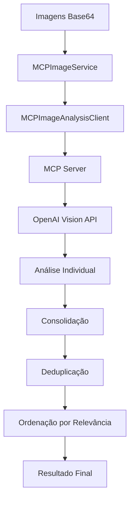

# MCP Image Analysis Module

## 📋 Visão Geral

Este módulo implementa um sistema de análise de imagens educacionais usando o **Model Context Protocol (MCP)** com integração à **OpenAI Vision API**. O sistema é projetado para analisar imagens e gerar conteúdo educacional estruturado para o ensino de inglês, incluindo sugestões de vocabulário, detecção de objetos e análise contextual.

## 🏗️ Arquitetura

```
src/mcp/
├── image_analysis_server.py    # Servidor MCP com tools de análise
├── mcp_image_client.py        # Cliente para comunicação com o servidor
└── __init__.py               # Módulo Python (vazio)
```

### Componentes Principais

1. **MCP Server** (`image_analysis_server.py`)
   - Servidor baseado em FastMCP
   - Ferramentas de análise de imagem via OpenAI Vision API
   - Processamento educacional especializado

2. **MCP Client** (`mcp_image_client.py`)
   - Cliente de comunicação com o servidor MCP
   - Interface simplificada para integração
   - Consolidação de múltiplas análises

## 🔧 Funcionalidades

### 🖼️ Análise de Imagens (`analyze_image`)

**Função:** Análise completa de imagem para criação de conteúdo educacional

**Parâmetros:**
- `image_data` (str): Imagem codificada em base64
- `context` (str): Contexto educacional adicional
- `cefr_level` (str): Nível CEFR (A1, A2, B1, B2, C1, C2)
- `unit_type` (str): Tipo de unidade (lexical_unit, grammar_unit)

**Retorna:**
```json
{
  "success": true,
  "analysis": {
    "structured_data": {
      "vocabulary_suggestions": [...],
      "contextual_themes": [...],
      "objects_and_scenes": [...],
      "educational_opportunities": [...]
    },
    "raw_analysis": "texto completo",
    "educational_context": {...}
  },
  "metadata": {
    "model_used": "gpt-4o-mini",
    "analysis_timestamp": "2025-07-27T...",
    "tokens_used": 1234
  }
}
```

### 📚 Sugestão de Vocabulário (`suggest_vocabulary`)

**Função:** Gera lista específica de vocabulário baseado na imagem

**Parâmetros:**
- `image_data` (str): Imagem codificada em base64
- `target_count` (int): Número alvo de palavras (padrão: 25)
- `cefr_level` (str): Nível CEFR para filtrar vocabulário

**Retorna:**
```json
{
  "success": true,
  "vocabulary": [
    {
      "word": "example",
      "phoneme": "/ɪɡˈzæmpəl/",
      "definition": "exemplo",
      "example": "This is an example sentence.",
      "word_class": "noun",
      "relevance_score": 9
    }
  ],
  "count": 25,
  "timestamp": "..."
}
```

### 🔍 Detecção de Objetos (`detect_objects`)

**Função:** Identifica objetos, pessoas, cenários e contextos na imagem

**Parâmetros:**
- `image_data` (str): Imagem codificada em base64

**Retorna:**
```json
{
  "success": true,
  "detection": {
    "structured_data": {
      "objects": ["objeto1", "objeto2"],
      "people": ["descrição1", "descrição2"],
      "setting": "descrição do local",
      "actions": ["ação1", "ação2"],
      "atmosphere": "descrição do ambiente",
      "text_detected": ["texto1", "texto2"],
      "educational_context": ["uso1", "uso2"]
    }
  }
}
```

## 🚀 Classes e Serviços

### MCPImageAnalysisClient

**Responsabilidade:** Cliente para comunicação direta com o servidor MCP

**Métodos principais:**
- `call_tool()`: Executa ferramentas do servidor
- `analyze_image()`: Wrapper para análise de imagem
- `suggest_vocabulary()`: Wrapper para sugestão de vocabulário
- `detect_objects()`: Wrapper para detecção de objetos

### MCPImageService

**Responsabilidade:** Serviço de alto nível para processamento de múltiplas imagens

**Método principal:**
- `analyze_uploaded_images_for_unit()`: Processa múltiplas imagens e consolida resultados

**Funcionalidades:**
- Análise sequencial de múltiplas imagens
- Consolidação e deduplicação de vocabulário
- Ordenação por relevância
- Limitação a 25 palavras finais
- Estatísticas de processamento

## 🔌 Integrações

### OpenAI Vision API
- **Modelo:** gpt-4o-mini
- **Funcionalidade:** Análise visual de imagens
- **Configuração:** Variável de ambiente `OPENAI_API_KEY`

### FastMCP Framework
- **Servidor:** Baseado em FastMCP para simplicidade
- **Comunicação:** Protocolo MCP via stdio
- **Tools:** Ferramentas assíncronas registradas

### Sistema IVO (Integração Externa)
- **Função de compatibilidade:** `analyze_images_for_unit_creation()`
- **Integração:** Endpoints V2 da API principal
- **Formato:** Mantém assinatura compatível com versão anterior

## 📊 Fluxo de Processamento



## ⚙️ Configuração e Uso

### Variáveis de Ambiente
```bash
OPENAI_API_KEY=your_openai_api_key_here
```

### Exemplo de Uso Básico
```python
from mcp_image_client import analyze_images_for_unit_creation

# Analisar imagens para criação de unidade
result = await analyze_images_for_unit_creation(
    image_files_b64=["base64_image_1", "base64_image_2"],
    context="Hotel reservation and check-in procedures",
    cefr_level="A2",
    unit_type="lexical_unit"
)

if result["success"]:
    vocabulary = result["consolidated_vocabulary"]["vocabulary"]
    print(f"Vocabulário encontrado: {len(vocabulary)} palavras")
```

### Execução do Servidor
```bash
cd src/mcp/
python image_analysis_server.py
```

## 📈 Estatísticas de Processamento

O sistema fornece estatísticas detalhadas:

- **Total de imagens processadas**
- **Análises bem-sucedidas**
- **Contagem de vocabulário:**
  - Palavras originais encontradas
  - Palavras únicas após deduplicação
  - Palavras finais (limitado a 25)
- **Metadados de modelo:**
  - Tokens utilizados
  - Timestamps de processamento
  - Modelo OpenAI usado

## 🎯 Casos de Uso Educacionais

### Criação de Unidades Lexicais
- Análise de imagens temáticas
- Extração de vocabulário relevante
- Definições em português
- Transcrições fonéticas (IPA)

### Criação de Unidades Gramaticais
- Identificação de contextos gramaticais
- Sugestão de estruturas baseadas na imagem
- Exemplos contextualizados

### Análise de Cenários
- Identificação de situações comunicativas
- Mapeamento de objetos e ações
- Contexto cultural e social

## 🔒 Tratamento de Erros

O sistema implementa tratamento robusto de erros:

- **Erros de conexão MCP:** Retorno estruturado com detalhes
- **Falhas na API OpenAI:** Logging e recuperação graceful
- **Parsing JSON:** Fallback para texto bruto quando necessário
- **Validação de dados:** Verificação de formatos e estruturas

## 📝 Logs e Debugging

- **Logging estruturado:** Usando biblioteca `logging` do Python
- **Rastreamento de erros:** Stack traces completos
- **Métricas de performance:** Timestamps e contadores
- **Debug info:** Estados intermediários disponíveis

## 🔄 Versionamento e Compatibilidade

- **Compatibilidade V2:** Mantém interface com API principal
- **Assinatura estável:** Função `analyze_images_for_unit_creation()` não muda
- **Evolução gradual:** Novos recursos adicionados sem quebrar existentes

---

**Nota:** Este módulo é parte do sistema IVO (Intelligent Vocabulary Optimizer) e foi projetado especificamente para análise educacional de imagens no contexto do ensino de inglês como segunda língua.